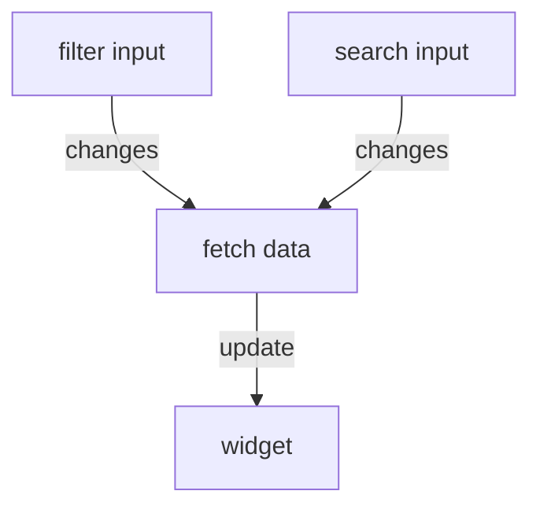

# Questions and Requirements:

**Q:** What plugins or extensions are best suited in the Angular + PrimeNG environment to achieve the goal and implement all functions? Provide a list or explain why additional plugins are not needed.

**A:** For the widget main functions we don't need anything more then PrimeNG.
We can use the Tree component which enables filtering and drag & drop of the tree nodes.
For resizing we can just use css `resize` property.
I couldn't find the icons used in PrimeNG icon library, so for that will need to use something else like fontawesome

**Q:** In what format should data be received to display the result?

**A:** The data should be an array of `TreeNode`.
The main properties we need are `label` , `key` and `children`

**Q:** How to request data for displaying the result (format)?

**A:** This really depends on the size of the data and how its stored in the database.

1. For small amount of data we can get all the data in one request and preform the filter and search on the client

`http.get('https://example.com/api/geo-objects)`

2. For large amount of data we will need to lazy load the children when the user clicks on a node. We will need to send the node ID and the search and filter.

`http.get('https://example.com/api/geo-object?id=659ba88faefd802c84e1e083&search=sensor2&filter=zones`

3. Another thing is to consider is how the data is stored in the database. Is it stored as embed documents or using references.

**Q:** How to implement multilingual support for types and names, and what is the
best way to do it?

**A:** We need to install the `@angular/localize` package.
Mark the text for translation and show language select menu.

**Q:** What to do if the server cannot return the desired format and is forced to
return bulky objects with fields in different writing styles?

**A:** We need to implement some kind of adapter function which transforms ths server response.
See `geoTreeNodeAdapter` function in utils.ts

## Widget operation chart

